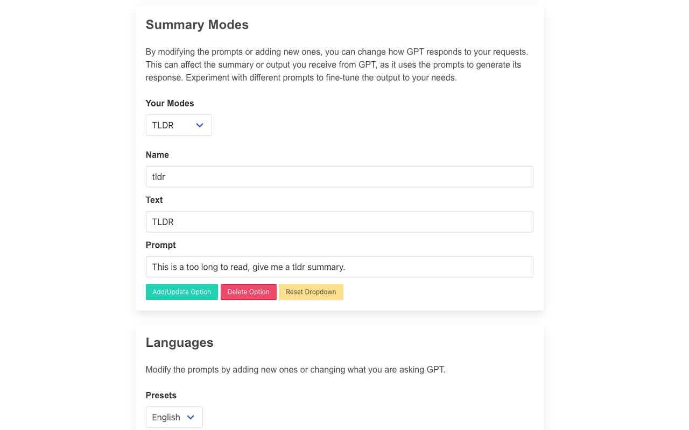
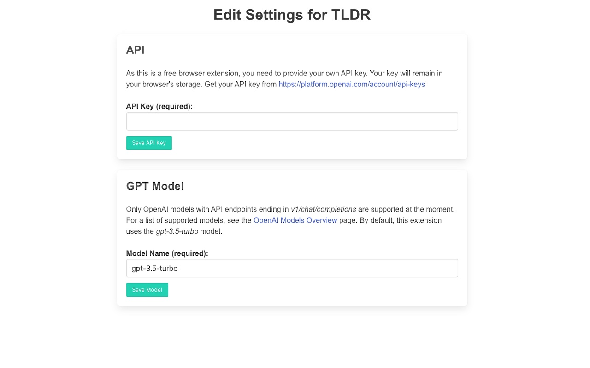

# TL;DR with GPT - Web Browser Extension

**TL;DR with GPT** generates summaries of news articles and online content by leveraging GPT's capabilities. In addition to its use as a time-saving tool for quickly checking and reading online content without the need to go through extensive text, the extension can also be helpful for individuals who need to translate articles from different countries and languages. With options for customization in summary modes and multilingual support, it offers a time-saving solution for individuals who need to stay informed about current events and trending topics.

The extension utilizes the [Readability](https://github.com/mozilla/readability) library  to extract content from web pages and then sends the extracted text to GPT for summarization. Currently, the extension is limited to processing around 1000 words due to GPT API limitations. However, future releases aim to improve this constraint by potentially sending content in multiple parts and aggregating the results, thereby providing a more comprehensive summary.
 

## Screenshots

## Prerequisites

To use this plugin, you need to have an [OpenAI API key](https://beta.openai.com/signup/).

### Configuring the OpenAI API Key

1. Sign up for an OpenAI account and obtain an API key from the [OpenAI Dashboard](https://beta.openai.com/signup/).
2. After installing the TLDR with GPT extension, go to the extension's settings or options page.
3. Enter your OpenAI API key in the designated field and save your changes.

Now, the TLDR with GPT extension will use your OpenAI API key to provide the summarization features.

## Installation

1. Download the latest code from this page.
2. Unzip the downloaded file.
3. Follow the installation instructions for your specific browser:

   ### Chrome / Chromium-based browsers
   - Open the Extensions page (`chrome://extensions`).
   - Enable Developer Mode (toggle switch in the top-right corner).
   - Click on "Load unpacked" and select the unzipped folder.

   ### Firefox
   - Open the Add-ons and Themes page (`about:addons`).
   - Click on the gear icon and select "Install Add-on From File."
   - Choose the unzipped folder and follow the prompts to complete the installation.

## Usage

1. Navigate to a news article or online content that you want to summarize.
2. Click on the TLDR with GPT extension icon in your browser toolbar.
3. Select the desired summary mode and language (if applicable).
4. Click "Summarize" to generate a concise summary of the content.

## Contributions
We welcome contributions to improve TLDR with GPT! Here are some current limitations and features that need to be addressed or fixed:

1. **Enhanced customization for GPT API parameters:** Provide users with more control over the GPT API settings, such as the ability to adjust the completion temperature, the number of tokens sent for summarization, and other relevant parameters.
2. **General UI fixes and improvements:** Enhance the overall user experience by addressing any UI inconsistencies, refining the layout, and implementing any necessary design updates to make the extension more visually appealing and user-friendly.

If you'd like to contribute, please submit a pull request or open an issue on the GitHub repository to discuss your proposed changes or additions.

## License

This project is licensed under the [MIT License](LICENSE).

